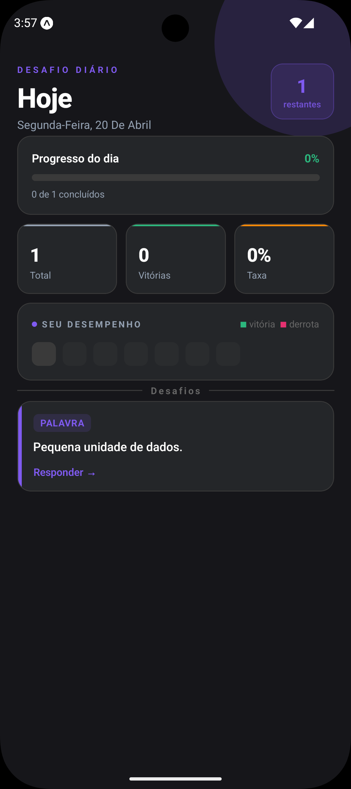

# Questify Go

**Questify Go** é um aplicativo mobile de desafio diário focado em estimular o raciocínio lógico de forma simples, rápida e intuitiva.

A proposta é criar um **hábito diário de estímulo mental**, com uma experiência minimalista e sem distrações.

---

## Preview

<p align="center">
  
  
  
</p>

---

## Conceito

* Um desafio por dia
* Execução rápida (1 a 3 minutos)
* Interface simples e objetiva
* Foco total na experiência do usuário

Não é um jogo complexo — é um ritual diário de pensamento.

---

## Proposta

O usuário acessa o app, resolve um desafio único do dia e recebe feedback imediato.

Sem menus complexos. Sem excesso de informações.
Apenas **desafio → tentativa → resultado**.

---

## Funcionalidades

* Exibição de desafio diário
* Sistema de tentativas
* Feedback de acerto e erro
* Resultado visual ao final
* Histórico de desempenho

---

## Tipos de desafio

Atualmente o sistema trabalha com desafios baseados em:

* Palavra (estilo Termo - 5 letras)
* Número
* Quiz
* Padrão lógico

---

## Tecnologias

### Mobile

* React Native (Expo)
* TypeScript
* StyleSheet (UI nativa)

### Backend

* Java + Spring Boot
* Spring AI (Gemini)
* PostgreSQL

---

## Arquitetura

### Mobile

* Home → desafio do dia
* Result → resultado da tentativa
* History → histórico do usuário

### Backend

* Geração de desafios com IA
* Validação de regras (ex: palavra de 5 letras)
* Controle de desafio diário
* Persistência de dados

---

## IA no projeto

O sistema utiliza IA para gerar desafios dinâmicos, com regras controladas pelo backend.

Fluxo:

```text
IA gera conteúdo → Backend valida → Sistema entrega desafio
```

Isso garante:

* consistência
* qualidade
* controle de regras

---

## Build Remoto (EAS) — Android

### Criar variável de ambiente

```bash
eas env:create
```

### Atualizar variável

```bash
npx eas env:update
```

### Configuração

* Nome: `EXPO_PUBLIC_API_URL`
* Valor: `https://api-homolog.seudominio.com`
* Visibilidade: Plain text

Selecionar ambiente:

```bash
◉ preview
◯ development
◯ production
```

Repita para `production` se necessário.

---

## Status

Em produção

---

## Autor

Ramon Barbosa
